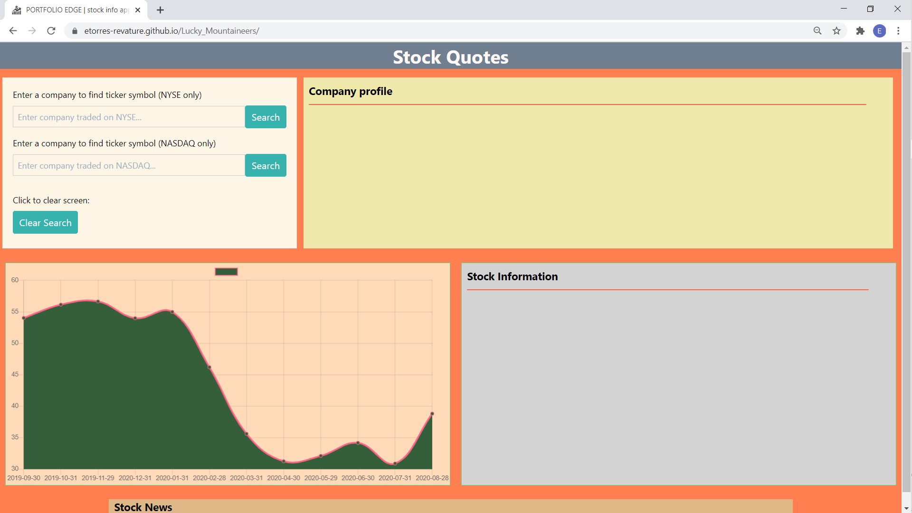
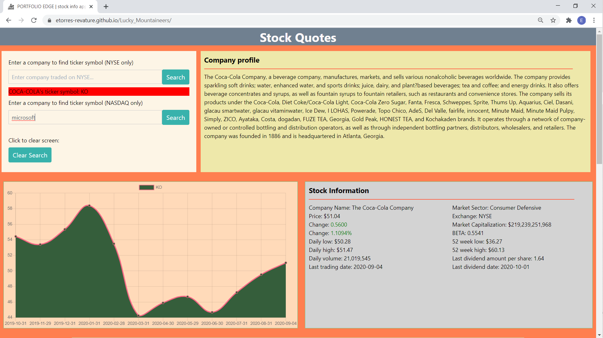
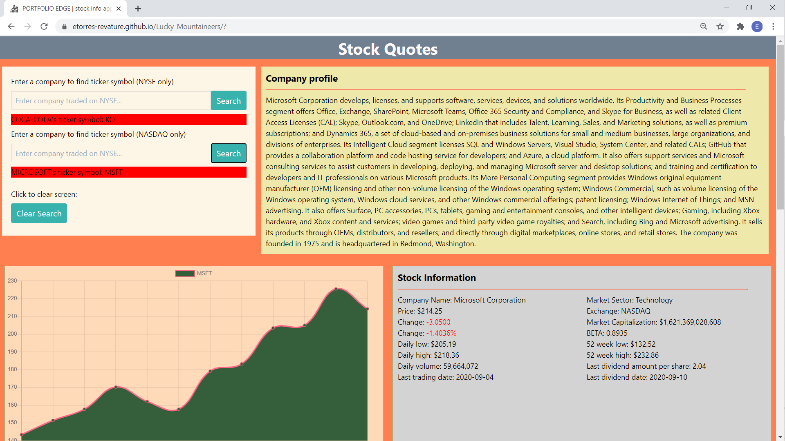
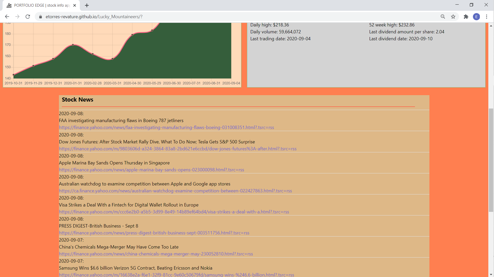
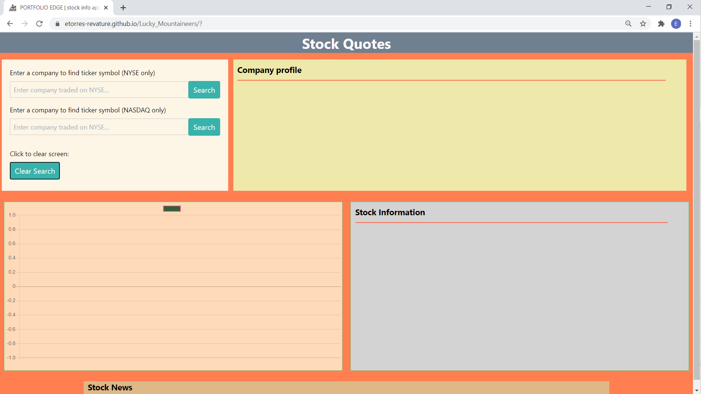
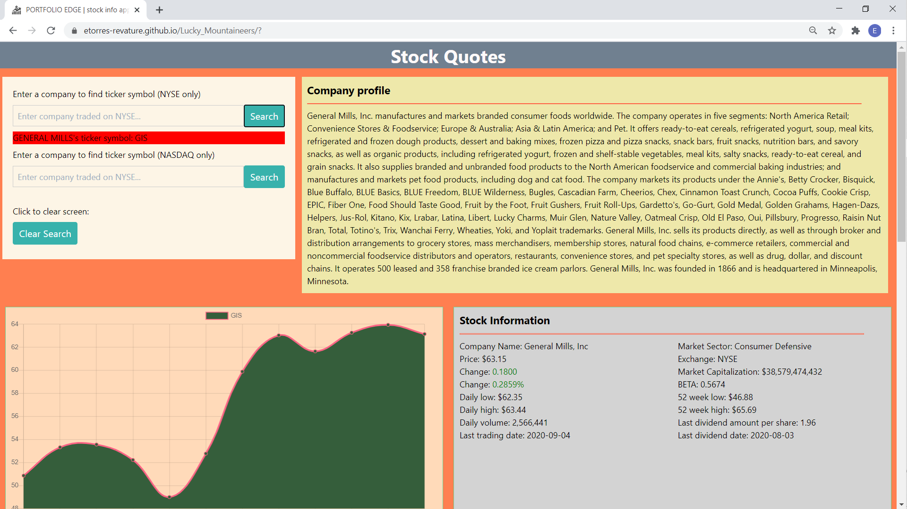

# [PORTFOLIO EDGE](https://etorres-revature.github.io/Lucky_Mountaineers/) :yen: :dollar: :pound: :euro: :moneybag: :money_with_wings:

Financial freedom is one of the main goals for every working person throughout the world.  Over time the single best return on your investment can be through the purchase of publicly traded stocks.  

Some big reasons to invest in the stock market:

1. Historically, the stock market goes up (appreciates) over time;
1. Reinvestment of returns and compounding interest can help your money grow more quickly;
1. Mitigation of potential risks by diversifying investments across multiple sectors;
1. Various forms of investment vehicles (ETFs/single stocks/mutual funds/etc.);
1. Generally, stock market returns beat inflation. <a href="#footnote1">[1]</a>

If you are ready to maximize your stock knowledge then [PORTFOLIO EDGE](https://etorres-revature.github.io/Lucky_Mountaineers/) is the web app for you.

## HOW PORTFOLIO EDGE WORKS 
 
This is the home screen of the PORTFOLIO EDGE web app:

Currently, users can choose to search either the New York Stock Exchange (NYSE) or the NASDAQ exchange.

In this example, a user is searching Coca-Cola on the NYSE:

Upon hitting the search button a brief company description is presented as the "Company Profile", a chart with the past 12-month price information is presented, and current and historical price information for the stock as "Stock Information":

Similarly, users can search for stocks on the NASDAQ exchange: 

And, receive "Company Profile"/12-month chart/"Stock Information" for that stock: 

Each search pulls the top fifteen latest news stories in the "Stock News" section:

Using the "Clear Search" button, users can remove all of the information from the most recently researched stock: 

And then, be ready to start all over again:

***Start using [PORTFOLIO EDGE](https://etorres-revature.github.io/Lucky_Mountaineers/) today!***

### STOCK APIs USED IN PORTFOLIO EDGE:

## Financial Modeling Prep

PORTFOLIO EDGE uses the Financial Modeling Prep [Ticker Search](https://financialmodelingprep.com/developer/docs/#Ticker-Search).  When the user inputs the company to search, PORTFOLIO EDGE then requests a ticker search from the API to return the appropriate stock ticker.  

One limitation of this search is that it is limited to one particular exchange.  So, the user has to know if the stock being searched is traded on the NYSE or NASDAQ and enter information into the appropriate input.

Check out the [Financial Modeling Prep](https://financialmodelingprep.com/developer/docs/) API documentation.

## Alpha Vantage

Once PORTFOLIO EDGE has received the information about the company's ticker symbol, it then uses the Alpha Vantage API for *Company Overview; Quote Endpoint; and the Monthly Time Series*.

**Company Overview** is used to pull the following information: 

* Company Description; 
* Company Name; 
* Market Sector; 
* Exchange; 
* Market Capitalization; 
* BETA; 
* 52 Week High/Low; and
* Last Divident Amount/Date.

**Quote Endpoint** is used to pull the following information: 

* Price;
* Change Value; 
* Change Percent; 
* Daily Low/High; 
* Daily Volume; and
* Last Trading Date.

**Montly Time Series** returns monthly stock information from the previous 240 months (20 years).  This information is distilled into the previous 12 months information and entered into the chart that is displayed on screen.

Check out the [Alpha Vantage](https://www.alphavantage.co/documentation/) API documentation. 

## Intrinio

Finally, each API concludes with a call to the Intrinio API for [All News](https://docs.intrinio.com/documentation/web_api/get_all_company_news_v2) to get the last fifteen top stock stories.  This allows PORTFOLIO EDGE users to remain up-to-date with the latest stock market news.

Check out the [Intrinio](https://docs.intrinio.com/documentation/api_v2/getting_started) API documentation.

### :computer: Technologies Used :computer:

#### :memo: HTML5 :memo:

**HTML5** is a markup language used for structuring and presenting content on the World Wide Web.  The goals are to improve the language with support for the latest multi-media and other new features; to keep the language both easily readable by humans and consistently understood by computers and devices; and to remain backward compatible to older software.  Many new symantec features are included.

*HTML5* content borrowed from <a target="_blank" rel="noopener noreferrer">[this page](https://en.wikipedia.org/wiki/HTML5).</a>

#### :art: CSS :art:

**Cascading Style Sheets (CSS)** is a stylesheet language used for describing the presentation of a document written in a markup language (such as HTML5).  CSS is designed to enable the separation of presentation and content; including layout, colors, and fonts.  This separation improves content accessibility to provide more flexibility and control in the specification of presentation characteristics, enabling multiple web pages to share formatting by specifying relevant CSS in a separate file, which reduces complexity and repetition in the structural content (HTML), as well as enabling the file to be cached to improve the page load speed between the pages that share the file and its formatting.

Separation of formatting and content also makes it feasible to present the same markup page in different styles for different rendering methods, such as on-screen, in print, by voice, and on Braille-based tactile devices. 

*CSS* content borrowed from <a target="_blank" rel="noopener noreferrer">[this page](https://en.wikipedia.org/wiki/Cascading_Style_Sheets).</a>

#### :cyclone: Tailwind CSS :cyclone:

**Tailwind CSS** is a highly customizable, low-level CSS framework that gives you all of the building blocks you need to build bespoke designs without any annoying opinionated styles you have to fight to override.

*Tailwind CSS* content borrowed from <a target="_blank" rel="noopener noreferrer">[this page](https://tailwindcss.com/).</a>

#### :sparkler: JavaScript :sparkler:

**JavaScript (JS)** is one of the core technologies of the World Wide Web (along with HTML and CSS). It enables interactive web pages and is an essential part of web applications.  JS is a multi-faceted, scripting language that provides versatility through Application Programming Interfaces (APIs) and Document Object Model (DOM) manipulation, among others.

*JavaScript* content borrowed from <a target="_blank" rel="noopener noreferrer">[this page](https://en.wikipedia.org/wiki/JavaScript).</a>

#### :chart_with_upwards_trend: Chart.js :chart_with_upwards_trend:

**Chart.js** is a free and open source JavaScript library that makes data visualization fun and easy.  Use the library in conjunction with the HTML5 canvas tag to quickly add data visualization to your JavaScript projects. 

Find out more about *Chart.js* at <a target="_blank" rel="noopener noreferrer">[this page](https://www.chartjs.org/docs/latest/).

## Author :sunglasses:

[PORTFOLIO EDGE](https://etorres-revature.github.io/Lucky_Mountaineers/) designed and executed by:

Lucky Mountaineers

* :cookie: Emmanuel Durand :cookie:
* :gem: Toccara Hicks :gem:
* :green_heart: Eric D. Torres :green_heart:
* :rainbow: Telicia Watson :rainbow:

Contact: etorresnotary@gmail.com. 

#### License

GNU General Public License - 3.0

<a name="Footnote1">[footnote 1:  5 Reasons to Invest in the Stock Market](https://money.usnews.com/investing/articles/2017-04-12/5-reasons-to-invest-in-the-stock-market)</a>

**WARNING:** *these statements are generalizations and should not be construed as actual financial advice.  Please consult a certified professional before investing in the stock market.*